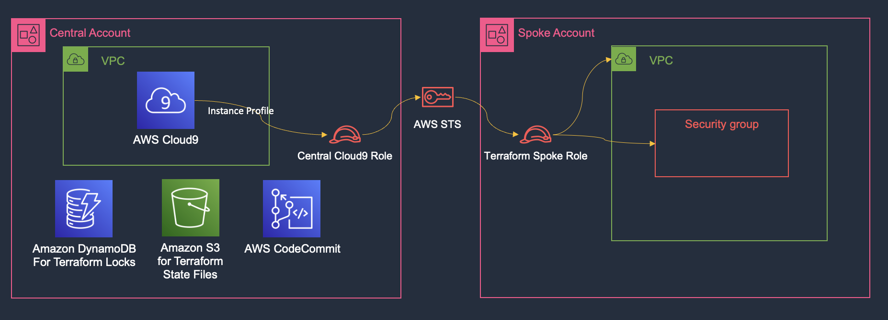
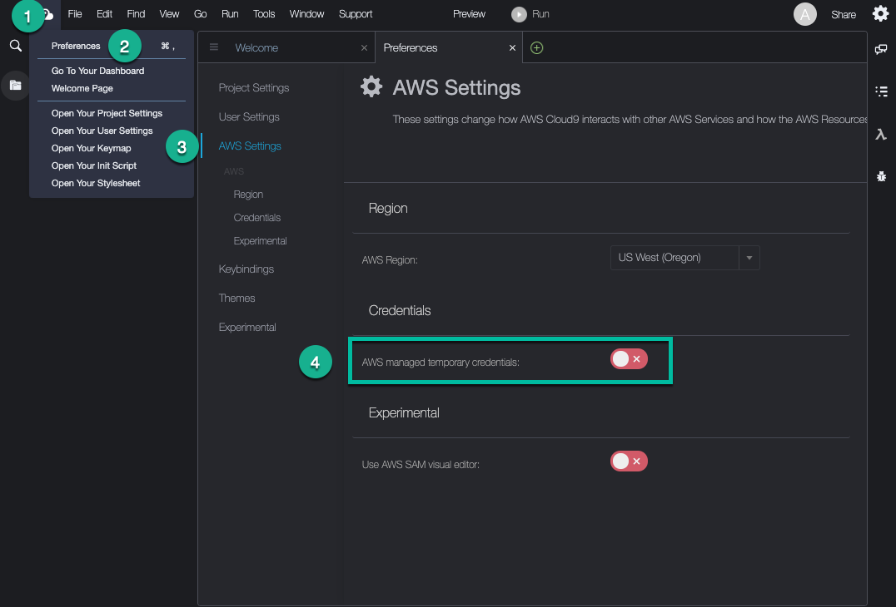
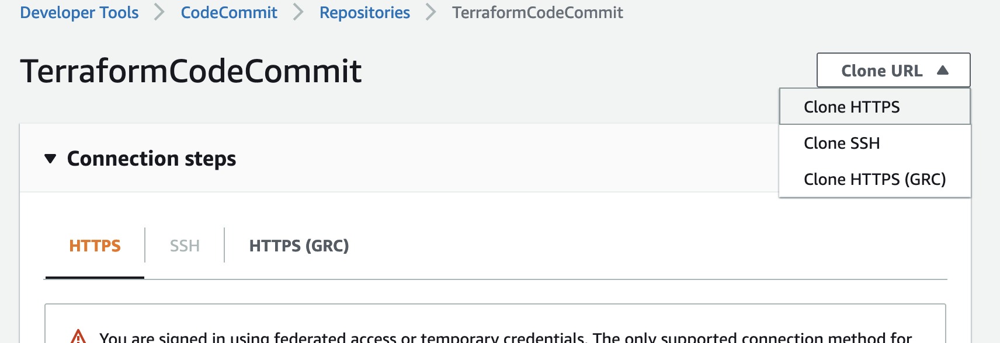
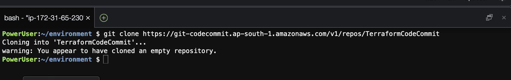
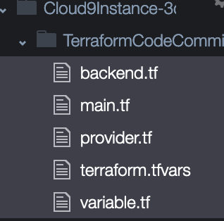
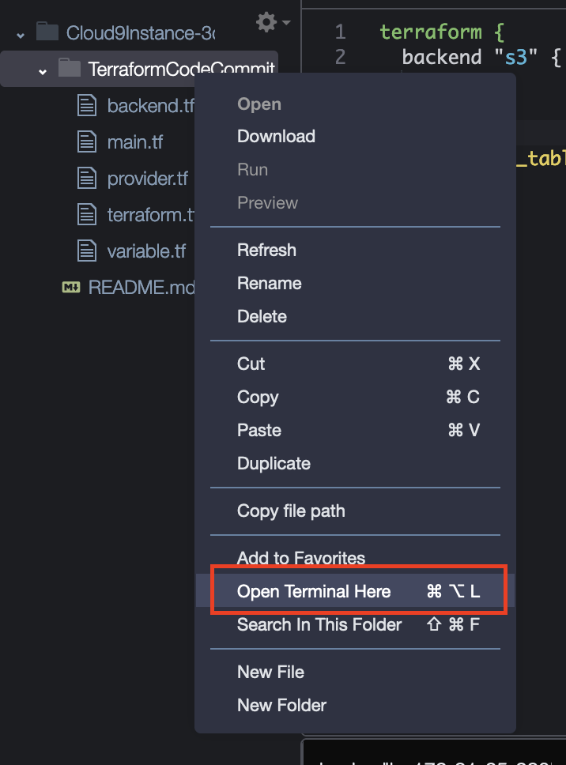

# Cloud9 to deploy Terraform cross-account cross-region infrastructure

**Intro paragraphs**: 

[Hashicorp Terraform](https://www.terraform.io/) is a popular Infrastructure as a Code (IaC) tool for customers Automate Infrastructure on Any Cloud. When customers are early in their Terraform journey on AWS, they need a starting point which is secure and follows all the best practices. This blog post will help in starting with best practices by creating an AWS Cloud9 instance as a web-based IDE, Amazon S3 for remote backend, Amazon DynamoDB for remote lock files, CodeCommit Repository for version controlling our Terraform Files and IAM Roles for cross account access.

Cloud9 is a web-based IDE that can be a single point to deploy Terraform code centrally. It integrates with [AWS CodeCommit](https://docs.aws.amazon.com/codecommit/latest/userguide/setting-up-ide-c9.html) which is used to create repositories for our Terraform [modules](https://www.terraform.io/language/modules/syntax) (a container for multiple resources that are used together) and implementation code. 

Terraform is a tool which helps manage multiple environments (kubernetes, active-directory, etc) and clouds using [Terraform Providers](https://registry.terraform.io/browse/providers). When using Terraform on AWS, users face following challenges - 

1. managing [AWS Security Credentials](https://docs.aws.amazon.com/general/latest/gr/aws-sec-cred-types.html#access-keys-and-secret-access-keys) using Secret Keys and Access Keys for multiple AWS accounts.
2. Local storage of infra code, [lock files](https://www.terraform.io/language/files/dependency-lock) and [state files](https://www.terraform.io/language/state) can be subject to single point of failure. Also tracking changes can be an issue - version control can help with this. 
3. Securely deploying and managing infrastructure [to multi-account, multi-region](https://docs.aws.amazon.com/whitepapers/latest/organizing-your-aws-environment/organizing-your-aws-environment.html).

This blog is used as a guide to setup infrastructure on AWS for Terraform deployments.

**How will this blog be useful?**

1. We will assign the Cloud9 instance in Admin/Central account an IAM Role and an IAM Role with trust relationship to the Admin IAM role in our Spoke accounts. This will eliminate the use of managing Secret and Access Keys
2. With version control of our Terraform infrastructure files we can track all the changes made to the infrastructure and revert to last working change in case of failures. We can also be sure that even if our AWS Cloud9 instance is terminated, our files are secure and can be used to continue building our infrastructure.
3. Can be used to quickly deploy all the resources like AWS DynamoDb Table for maintaining locks and AWS S3 for storing state files securely without single point of failure.
4. This can be used to have a better control on our multi-account infra, until we get the confidence and automation in place to create a CI/CD pipeline for our Infrastructure with Terraform.


**Overview**:


As shown in the diagram, we will be creating a Cloud9 environment, IAM Role for Cloud9 instance, S3 bucket for state files, DynamoDB Table for Locks and AWS CodeCommit in the central account, central region.

In the spoke account, we will be creating an IAM Role to allow IAM Role for Cloud9 instance to assume this role for deploying a VPC and a security group in the spoke account.

We will use Cloud9 Environment to deploy resources in Spoke Account (any region) using [AssumeRole](https://learn.hashicorp.com/tutorials/terraform/aws-assumerole) capability of Terraform AWS Provider.

### Prerequisites 

* Two[AWS accounts](https://console.aws.amazon.com/).- Central Account, Spoke account
* Access to the AWS CloudFormation
* Permission to create resources in both central and spoke account
* Understanding of Terraform with Providers and Backends
* Understanding Git
* Understanding of Amazon DynamoDB, Amazon S3 with respect to Terraform Deployments and also services like AWS CodeCommit, AWS Cloud9, AWS IAM Roles cross-account access


## Target technology stack 

AWS Cloud9 Instance, IAM Role, Terraform, AWS CodeCommit (Git), Amazon S3 Buckets, Amazon DynamoDB Table


## Tools

**CloudFormation** - To Deploy initial infrastructure to securely deploy Cloud9, IAM Roles, AWS CodeCommit (Git), Amazon S3 Buckets, Amazon DynamoDB Table
**Cloud9** - As an IDE/Jumpbox for Cross-Account/Cross-Region infrastructure deployments.
**CodeCommit - **Version Control for Terraform Code.
**AWS S3 - **Used as a backend to store state files of Terraform infrastructure.
**AWS DynamoDB -** Used as a DB to store Terraform Locks
**AWS IAM - **IAM roles are used to assign to an EC2 instance using Instance Profile and also enable us to gain cross account access.

**Walkthrough:**

Clone [this](https://gitlab.aws.dev/davdbada/cloud9-terraform-deployments) GitHub repository locally

### **Step 1 - Central Account Infrastructure Deployment**

**CloudFormation Stack to create resources -** 

1. Login to [AWS Console](https://console.aws.amazon.com/)
2. Go to [CloudFormation Console](https://console.aws.amazon.com/cloudformation)
3. [Create the CloudFormation stack](https://docs.aws.amazon.com/AWSCloudFormation/latest/UserGuide/cfn-console-create-stack.html) from the template - Cloud9CFN.yaml
4. Add stack parameter - TerraformBackendBucketName and Add an appropriate unique bucket name.
5. Once the stack creation is complete, copy all the values from the Outputs section

BackendDynamoDbTable, S3BackendName and TerraformCloud9Role

**Note - **
By default, we are making use of [no-ingress EC2 instances](https://docs.aws.amazon.com/cloud9/latest/user-guide/ec2-ssm.html) to maintain instance security. Security Group for this type of EC2 instance also do not have any inbound rule.
If you're using a private subnet (Recommended), allow the instance for the subnet to communicate with the internet by hosting a NAT gateway in a public subnet.
If you're using a public subnet (not to be used for production), attach an internet gateway to the VPC and internet gateway route to public subnet so the SSM Agent for the instance can connect to Systems Manager.

**Note -**
Private Subnet with VPC Endpoints will establish Cloud9 connection but Terraform module downloads and provider downloads will fail unless there is internet access.
AWS administrator, AWS DevOps, AWS systems administrator, Cloud administrator

### **Step 2 - Spoke Account infrastructure Deployment**

Here we will see infrastructure to be created in the Spoke AWS Account using step by step approach

1. Login to Spoke account using [AWS Console](https://console.aws.amazon.com/) 
2. Go to [CloudFormation Console](https://console.aws.amazon.com/cloudformation)
3. [Create the CloudFormation stack](https://docs.aws.amazon.com/AWSCloudFormation/latest/UserGuide/cfn-console-create-stack.html) from the template - SpokeCFN.yaml
4. Add stack parameter - CentralAccount - Use account number where you created the Cloud9 CloudFormation Stack.

This will create an IAM Role which will create a trust relationship with the role that has been associated to the Cloud9 Instance and therefore enable cross-account access from this Cloud9 instance.

**Step 3 - Cloud9 in Central Account**

1. Logout from the Spoke account and again Login to the Central Account
2. Go to [Cloud9 Console](https://console.aws.amazon.com/cloud9/) in the Central Account
3. Select the Cloud9 Console and Click on Open IDE

**Note**: If the Open IDE option is greyed out, please make sure that the user/role that you have created the CloudFormation stack is the same user/role that is trying to access the Cloud9 environment.

**Configure AWS credentials for your Cloud9 Workspace**

Click on the Cloud9 logo in the top left corner

* Choose Preferences
* In the Preferences tab go to AWS Settings
* Turn off AWS managed temporary credentials
* Close the Preferences tab

This ensures that instead of User/Role credentials, the IAM Role which has been attached to the EC2 instance is used to establish cross account access.

Note: In case you get Session Token Expired error, make sure that you repeat the step to toggle AWS managed temporary credentials in Preferences page of Cloud9.

**Clone CodeCommit Repository -**

1. Go to [CodeCommit console](https://console.aws.amazon.com/codesuite/codecommit/home.)
2. Click on TerraformCodeCommit repository
3. Click on Clone HTTPS



4. Go to Cloud9 Console and add command -

```
git clone <Paste the Repo Copied Above>
```



An empty repo will be added here.

**CloudFormation Stack to create resource in Spoke account -** 

1. Login to Spoke account using [AWS Console](https://console.aws.amazon.com/) 
2. Go to [CloudFormation Console](https://console.aws.amazon.com/cloudformation)
3. [Create the CloudFormation stack](https://docs.aws.amazon.com/AWSCloudFormation/latest/UserGuide/cfn-console-create-stack.html) from the template - SpokeCFN.yaml
4. Add stack parameter - CentralAccount - Use account number where you created the Cloud9 CloudFormation Stack.

This will create an IAM Role which will create a trust relationship with the role that has been associated to the Cloud9 Instance and therefore enable cross-account access from this Cloud9 instance.

#### TERRAFORM DEPLOYMENT

**Creating a VPC and Security Group from Sample Terraform Code**

1. Go back to your Cloud9 IDE in Central account.
2. Copy all files from Terraform Directory into the empty TerraformCodeCommit directory in Cloud9 Workspace by dragging and dropping from your local machine.
3. Now Make changes to following files -



backend.tf

```
terraform {
  backend "s3" {
    bucket         = BACKEND_S3_BUCKET
    key            = "vpc_securitygroup_sample/terraform.tfstate"
    region         = REGION
    dynamodb_table = LOCK_DYNAMODB
    encrypt        = true
  }
}
```

Use the Values from BackendDynamoDbTable in place of *LOCK_DYNAMODB*, S3BackendName in place of *BACKEND_S3_BUCKET* and the Region where you created the CloudFormation template in place of *REGION*.

provider.tf

```
provider "aws" {
  region = DESTINATION_REGION
  assume_role {
    role_arn = "arn:aws:iam::${var.spoke_account}:role/TerraformSpokeRole"
  }
}
```

Add the region name where you would like to deploy this vpc and the security group in place of DESTINATION_REGION

terraform.tfvars

```
spoke_account = SPOKEACCOUNT
```

Add the account number (where you deployed the spoke CloudFormation template) where you want to create these resources.

**Once the CloudFormation Stack Creation is complete -**

1. Right-Click the directory where all of these files reside and click on open terminal here



1. Run all these commands in the Cloud9 Workspace terminal -

```
terraform init
```

```
`terraform plan -out=tfplan -input=false`
```

```
terraform apply `-input=false tfplan` 
```

**Use git commands to add these files to the Code Commit repository -**

```
git add *
git commit -m "First Commit"
git push
```

This will keep these files version controlled.

**Validate -**
a. Validate that VPC and the Security Group are created in the the spoke account and region that were added in the provider.tf files.
b. Validate if the Backend state files are created in the S3 bucket from S3 console.
c. Validate if you can find the terraform files in CodeCommit Repository by navigating to CodeCommit console.

**Cleanup -**

1. From Cloud9 console, destroy all the resources created via terraform using in the same directory - 
2. `terraform destroy`
3. Now, we need to empty S3 bucket for successful deletion of CloudFormation stack -
4. Empty S3 bucket - You can use the Amazon S3 console to empty a bucket, which deletes all of the objects in the bucket without deleting the bucket.

To empty an S3 bucket

        1. Sign in to the AWS Management Console and open the Amazon S3 console at https://console.aws.amazon.com/s3/.
        2. Bucket name list, select the option next to the name of the bucket that you want to empty, and then choose **Empty**.
        3. Empty bucket page, confirm that you want to empty the bucket by entering the bucket name into the text field, and then choose **Empty**.
        4. Monitor the progress of the bucket emptying process on the **Empty bucket: Status** page.
1. Next, delete the CloudFormation stack from Spoke account and then Cloud9 Central Account.

